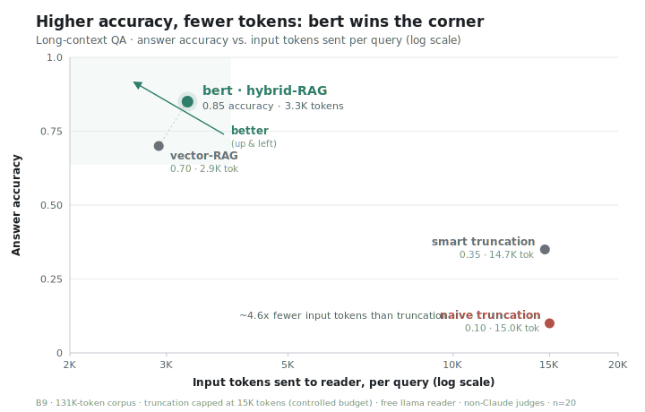

# bert

> Long-context project-memory and retrieval infrastructure for Claude Code / Cursor / Codex. When a project outgrows the model's context window, bert's hybrid retrieval keeps answer quality flat at near-constant input cost — where full-context stuffing becomes infeasible and naive truncation drops to zero.

<p align="center">
  <picture>
    <source media="(prefers-color-scheme: dark)" srcset="assets/bench-rag-dominance-dark.svg">
    
  </picture>
</p>

<p align="center"><sub>Long-context RAG (B9): a 131K-token corpus with truncation capped at a 15K-token budget (a controlled stand-in for a context limit, so retrieval and truncation compete at a fixed cost). The case that <i>genuinely exceeds a model's window</i> (a 3.0M-token corpus vs. a 1M window) is in <a href="#results-honest-falsification-first">Results</a>. Reproducible from <code>benchmarks/</code>.</sub></p>

> This repository is the curated public release; development prior to June 2026 lived in a private research lab and its operational history is kept there.

bert is a local **MCP server** that gives an AI coding host a persistent, per-project memory + hybrid-retrieval layer. It exists for one specific, measured problem: **projects that outgrow the model's context window.** A frontier model with a large window can brute-force anything that fits inside it — but no one stuffs a 10M-token project into a prompt. When the corpus exceeds the window, full-context becomes infeasible, naive truncation drops the answer, and retrieval is the only thing that still works. That regime is the entirety of what bert claims.

Those claims come from a benchmark program built to **falsify** them. The honest result up front: **bert's orchestration does NOT make a model produce better single deliverables.** With the model held constant, orchestration showed ≈0 quality gain at 17–47× the token cost, and a cheaper-model-plus-harness arm (0.79) scored *below* the same bare model (0.87) and never beat the bare frontier model (0.89). What the data *does* support is the long-context retrieval value below. The credibility here is the rigor and the published nulls, not a leaderboard claim.

## What bert is / is NOT

**IS:** a local stdio MCP server; a hybrid retrieval engine (dense vector + BM25 + cross-encoder rerank, fused by RRF) over a per-project corpus; a free-tier dispatch + verification harness.

**is NOT:** a better agent/reasoner (disproved — see below); "a cheaper model + harness that matches the frontier" (disproved); an autonomous lab that beats frontier models; a SaaS (it's a single-tenant local process, stdio only).

## Results (honest, falsification-first)

**Long-context RAG — the one confirmed value** (httpx+starlette corpus, free-llama reader, non-Claude judge):

| arm | accuracy | input tokens | needle-tier |
|---|---|---|---|
| naive truncation (15K) | 0.10 | 15,000 | 0.00 |
| smart truncation (15K) | 0.35 | 14,709 | 0.25 |
| **bert hybrid-RAG** | **0.85** | **3,278** | **0.88** |

Here the reader's input is capped at ~15K tokens, a controlled stand-in for a context limit, so retrieval and truncation compete at a fixed budget. This 131K corpus still fits inside a real model window; it isolates *answer-per-token efficiency*. The result that **genuinely exceeds the window** is the wall below.

**The full-context wall** (1M-token model): at 132K (fits) full-context scores 1.00; at **3.0M (exceeds the window) full-context is INFEASIBLE**, truncation scores **0.00**, and bert-RAG holds **0.75 at a flat ~3.3K input tokens**. Retrieval is the *only* option above the window.

**The bug this benchmark caught:** the first end-to-end B9 run scored near-random. Root cause was a silent fusion bug in the *production* retriever — a result-key mismatch zeroed the vector signal and snippets were truncated to 240 chars, so "hybrid" fusion was effectively lexical-only. The BEIR harness never caught it because it exercised a separate code path. Fixing fusion took the held-out QA eval from near-random to the **0.85** above, and is why every benchmark here now runs against the shipped retriever rather than a bench-only fork.

**What was disproved** (reported as the headline, not buried): orchestration on a frontier model — ≈0 gain at 17–47× tokens; cheaper-model-plus-harness — bert-Sonnet 0.79 < bare-Sonnet 0.87 < bare-Opus 0.89, never won.

**Industry-standard anchors** (recognized benchmarks, comparable to published baselines):
- **BEIR — scifact + nfcorpus + fiqa** (the standard IR benchmark, nDCG@10): bge-base-en-v1.5 matches the published bge-base reference on all three (0.740 / 0.374 / 0.406), and the full stack beats published BM25 on every dataset (**+0.080 / +0.049 / +0.198**). On scifact the hybrid + cross-encoder rerank reaches **0.745**; the cross-encoder is honestly dataset-dependent (a big win on fiqa, flat on nfcorpus). See [`benchmarks/results/B2_BEIR_MULTI_RESULT.md`](benchmarks/results/B2_BEIR_MULTI_RESULT.md).
- **Needle-in-a-Haystack** (the de-facto context-window test): bert-RAG **25/25** across a depth×length grid *including 2× the window*, where full-context is infeasible. (Single-needle NIAH, not RULER; the full-context arm is quota-bounded.) See [`benchmarks/results/B10_NIAH_RESULT.md`](benchmarks/results/B10_NIAH_RESULT.md).

Full methodology, results, and limitations: [`benchmarks/BENCHMARK_SYNTHESIS.md`](benchmarks/BENCHMARK_SYNTHESIS.md).

## Install (MCP server)

bert is a local stdio MCP server. **The retrieval layer needs no LLM and no API keys** — it embeds locally (`bge-base-en-v1.5`, 768-dim, ~440 MB) + BM25 + a local cross-encoder reranker (`bge-reranker-v2-m3`, ~568 MB), both downloaded once by `pip`/HuggingFace. The *answering* is done by your **host model** (Claude Code / Cursor / Codex): the host calls `memory_search`, bert returns the relevant chunks, and the host's own model reasons over them. No Ollama, no llama — the free-tier llama in the benchmarks was only a controlled reader to isolate retrieval quality.

```bash
git clone https://github.com/harshithkantamneni/bert && cd bert
python -m venv .venv && .venv/bin/pip install -e .     # pulls sentence-transformers, sqlite-vec, etc.
```

Register with Claude Code:
```bash
claude mcp add bert -- /abs/path/to/bert/.venv/bin/python -m tools.mcp.bert_lab
```

Or in `claude_desktop_config.json` / Cursor (`mcpServers` block):
```json
{ "mcpServers": { "bert": {
    "command": "/abs/path/to/bert/.venv/bin/python",
    "args": ["-m", "tools.mcp.bert_lab"],
    "env": { "PYTHONPATH": "/abs/path/to/bert" } } } }
```

The host then gets tools to ingest/inspect a project corpus, **`memory_search`** (the retrieval layer — the value), and proof-packet export. Labs live under `~/.bert/labs/<name>/`.

**Optional — provider keys** (only for the autonomous lab-*cycle* feature, where bert dispatches its own model calls rather than letting the host reason): put any subset in **your own** `~/.bert-lab/credentials.json` (mode 600). Keys are never bundled and never reach the host model — they stay in bert's outbound HTTP calls. The core retrieval/memory product needs none of this.
```bash
mkdir -p ~/.bert-lab && printf '%s\n' '{ "GROQ_API_KEY": "...", "NVIDIA_API_KEY": "..." }' > ~/.bert-lab/credentials.json && chmod 600 ~/.bert-lab/credentials.json
```

## Architecture

A subsystem map (MCP layer → core dispatch → memory + retrieval → verification), the full benchmark tables, and a "where to look" index are in [`ARCHITECTURE.md`](ARCHITECTURE.md).

## License

MIT — see [`LICENSE`](LICENSE).
